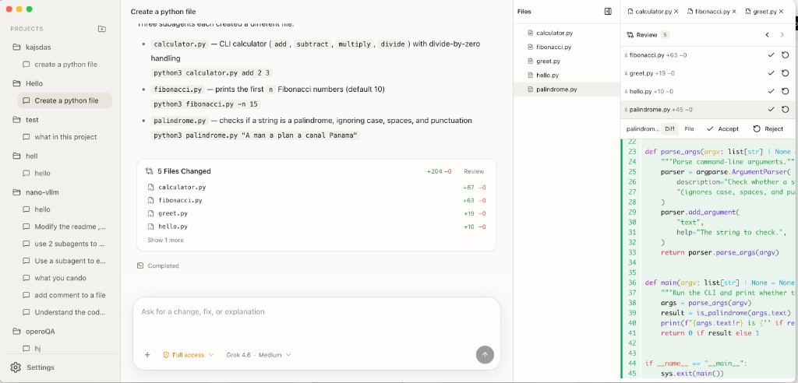

# Codey architecture walkthrough

[Open the interactive architecture canvas](https://cursor.com/dashboard/shared-canvases?shareId=canvas-H8FnA3xlJmLp6AX1VYyWzMkf)



Codey is a local macOS Electron application for running coding agents against user-selected projects. It separates desktop authority from agent execution, gives every agent an isolated runtime, persists conversations independently from those runtimes, and keeps Git and credential operations outside the sandboxed worker.

There is no localhost application server. Communication crosses explicit Electron IPC and private JSON-RPC boundaries.

## System at a glance

```text
User
  |
  v
React renderer
  |  window.desktop
  v
Context-isolated preload
  |  typed Electron IPC
  v
Electron Main
  |-- projects, conversations, settings, SQLite
  |-- Local and Worktree execution roots
  |-- Git review refs and file watching
  |-- credentials and provider configuration
  `-- TaskRuntimeRegistry -> TaskController
          |  private JSON-RPC over stdio
          v
      Agent Host supervisor
          |-- process lifecycle and approval broker
          |-- credential injection and SRT policy
          `-- one SRT-confined Pi worker
                  |-- model session and JSONL transcript
                  |-- AG-UI event mapping
                  `-- direct read/write/edit/search/bash children
```

AG-UI events travel back through the same chain with task, run, and agent identity:

```text
Pi worker -> Agent Host -> Electron Main -> preload -> renderer
```

## Architectural invariants

- Electron Main is the desktop authority and sole SQLite, Git, review, settings, and credential owner.
- A conversation is durable data; an Agent Host is a disposable executor.
- Every lead or subagent has its own Agent Host, Pi session, JSONL transcript, and SRT boundary.
- Pi tools cannot call Electron IPC or access Git control metadata.
- Local execution is exclusive per project.
- Worktree conversations have isolated branches and may run in parallel.
- Main owns delegation scheduling, dependency resolution, cancellation, and the single-writer lease.
- Review acceptance is represented by a private Git tree, separate from the live execution branch.
- Access modes may grant eligible resources but cannot override permanent denials.

## Process and trust boundaries

### Renderer

The React renderer owns presentation and transient interaction state:

- project and conversation navigation;
- activity, reasoning, and tool rendering;
- selected lead or subagent view;
- queue, todo, review, and permission UI;
- optimistic updates while IPC commands are in flight.

It runs with context isolation, renderer sandboxing, and Node integration disabled. It cannot access the filesystem, SQLite, Git, credentials, or Agent Host processes.

### Preload

Preload exposes the `window.desktop` bridge. It maps allow-listed product commands to Electron IPC and validates pushed task, runtime, permission, file, review, and credential payloads before they enter React.

Preload is an adapter rather than a state owner.

### Electron Main

Main composes the desktop application and owns:

- BrowserWindow creation and application lifecycle;
- trusted-sender checks and IPC input parsing;
- project registration and capability probing;
- Local and Worktree routing;
- SQLite projections and orchestration records;
- file browsing, watching, and review invalidation;
- Git worktrees and private review refs;
- encrypted provider credentials;
- Agent Host pooling, startup, disposal, and termination;
- lead/subagent scheduling and event multiplexing.

`TaskRuntimeRegistry` coordinates conversations and agents. `TaskController` adapts one lead or child agent to one Agent Host connection.

### Agent Host supervisor

The supervisor is a Node subprocess outside SRT. It owns:

- worker process groups;
- immutable mode-derived sandbox profiles;
- real provider credentials in memory;
- permission and delegation brokering;
- worker replacement for new external-path grants;
- Pi session attach, reopen, continuation, and disposal.

Main communicates with the supervisor through newline-delimited JSON-RPC over stdin/stdout.

### Pi worker

The worker runs inside SRT and owns:

- the Pi model session;
- model and thinking-level selection for a run;
- per-agent JSONL conversation history;
- tool registration;
- queue and todo behavior;
- Pi-to-AG-UI event conversion.

Filesystem and shell tools execute as direct child processes and inherit the worker's SRT boundary.

## Domain model

### Project

A project is a registered local folder. It may be a Git repository or a non-Git directory, subject to the selected execution target.

### Conversation

A conversation is the durable top-level unit shown in the sidebar. It stores:

- project identity;
- Local or Worktree execution target;
- access and interaction modes;
- durable status and renderer projection;
- lead Pi session reference;
- review baseline identity.

The execution target is fixed when the conversation is created.

### Task run

A task run represents one active lead prompt. It provides the shared parent identity for lead and child agent runs and for delegations created during that prompt.

### Agent and delegation

The lead agent owns the user conversation. A delegation records a child request, selected profile, capability, foreground/background behavior, dependencies, and terminal result.

Dependency edges form a Main-owned DAG within one task run.

## Conversation lifecycle

1. The renderer creates a conversation with its project, execution target, access mode, and interaction mode.
2. For Worktree execution, Main creates `codey/<taskId>` in app-managed storage and records its Git identity.
3. On prompt submission, Main checks project concurrency and inserts a running task-run record.
4. `TaskRuntimeRegistry` prepares or reopens the runtime while `GitReviewService` ensures the accepted review baseline.
5. `TaskController` claims a pooled supervisor, boots the required SRT profile, and attaches the Pi session.
6. The controller emits `RUN_STARTED` and sends the prompt.
7. Pi executes model turns and tools inside SRT.
8. Agent events return through the supervisor and Main as identity-rich AG-UI envelopes.
9. The renderer folds streaming text, tools, queues, todos, retries, and terminal events into its view model.
10. Main finishes task, run, agent, and delegation state, saves the conversation projection, releases locks, and applies idle-runtime retention.

Runtime readiness and durable conversation status are separate state machines:

```text
Runtime: cold -> preparing -> ready -> running -> ready

Task:    idle -> running
                    |-> completed
                    |-> cancelled
                    |-> interrupted
                    `-> failed
```

A conversation without a Pi session remains `cold` until its first prompt. A conversation with a stored session can render from SQLite immediately while Main reattaches its Agent Host in the background.

## Execution roots

### Local

Local execution uses the registered project directory directly. A Local run holds an exclusive project lock and cannot overlap a Local or Worktree sibling.

Non-Git Local folders use an app-owned shadow Git object store for review data without initializing Git inside the user directory.

### Worktree

Worktree execution requires a non-bare Git repository with a commit. Main creates an app-managed checkout on `codey/<taskId>`.

Before using that checkout, Main validates:

- repository identity;
- common Git directory;
- branch identity;
- expected worktree path.

Identity drift fails closed. Worktree conversations may run concurrently because each has a separate branch and filesystem root.

## Multi-agent orchestration

The lead Pi session exposes the only `task` delegation tool. The tool requests orchestration; it does not perform orchestration.

Main handles a delegation as follows:

1. Validate the requested profile and capability.
2. Reject capability elevation from a read-only parent to a writer.
3. Reject background write agents.
4. Validate that dependencies belong to the same task run.
5. Persist the child agent, delegation, and dependency edges.
6. Wait for dependencies to complete.
7. Acquire the conversation's writer lease when the child can write.
8. Create a separate `TaskController` and Agent Host.
9. Forward child events with child agent identity without changing the lead task status.
10. Persist the terminal result, release the lease, and resolve foreground waiters or notify the lead of background completion.

Foreground delegation blocks the lead tool call. Read-only children may run in the background while the lead prompt remains active. Write children are foreground-only, and only one agent may hold the writer lease for a conversation.

Cancellation recursively cancels dependent delegations before aborting the lead.

The built-in `coding` profile is always available. A repository may define narrower profiles in `.codey/agents.json`; repository configuration cannot broaden sandbox policy.

## Queue and todo behavior

Pi JSONL is canonical for todo state:

- active-run edits go through the attached Agent Host;
- idle edits open the stored Pi session directly;
- todo updates are projected to SQLite and renderer state;
- Agent mode may issue up to three hidden continuation turns while actionable todos remain stale;
- Plan mode never auto-continues.

Steer and follow-up queues live in Pi and Agent Host memory. They are not written to SQLite.

## Security and access

### Interaction modes

- **Agent:** enables the agent tool set allowed by the access profile.
- **Plan:** uses read-only tools and an OS-level read-only sandbox profile.

Changing interaction or access mode requires an idle conversation. Main disposes and recreates the runtime with a new immutable boot profile.

### Access modes

- **Ask:** eligible access requires user approval.
- **Approve for me:** eligible requests may be approved by policy.
- **Full:** grants the broad product-defined profile.

All three modes retain protected-path and machine-boundary denials.

### External-path grants

An SRT profile cannot be mutated while the worker is running. A new run-scoped file grant therefore follows a replacement flow:

1. The worker requests access through the supervisor.
2. Main routes the request to the renderer or access policy.
3. The supervisor records the approved grant.
4. The supervisor terminates the worker process group.
5. A replacement worker starts with the expanded SRT profile.
6. The Pi session reopens from JSONL.
7. A hidden continuation resumes the interrupted model turn.
8. The worker is recycled after settlement to remove the run-scoped grant.

### Credentials

Provider credentials are encrypted with Electron `safeStorage`, backed by macOS Keychain. Renderer APIs return configured status only.

Real credentials remain in Main and the outside supervisor. The worker receives masked sentinels; SRT's TLS proxy substitutes real values only for approved provider hosts.

### Permanent denials

Every access mode blocks:

- provider credential storage;
- application data;
- Git control metadata, configuration, and hooks;
- local services and TCP listeners;
- Unix sockets;
- Apple Events;
- pseudo-terminals.

Sandbox initialization fails closed.

## Persistence and recovery

### SQLite

Main is the sole SQLite writer. SQLite stores:

- projects and project capabilities;
- conversations and renderer projections;
- task runs;
- lead and child agents;
- delegations and dependency edges;
- execution target and Worktree metadata;
- access and interaction modes;
- settings and encrypted credential records;
- immutable Pi session references.

### Pi JSONL

Each lead or child agent has a separate Pi JSONL file. JSONL is canonical for transcript, tool history, branch state, and todos. SQLite holds read projections rather than replacing that history.

### Git review state

The accepted review baseline is stored at `refs/codey/review/<taskId>`. A private index is rebuildable and never touches the user's normal index.

### In-memory state

Runtime connections, queued follow-ups, pending approvals, writer ownership, waiters, and renderer interaction state are process-local.

### Restart behavior

On application startup, durable rows left in `running` state become `interrupted`. The application does not automatically resume the run.

Opening the conversation:

1. renders the SQLite projection;
2. validates its execution root;
3. reattaches the stored Pi session when available;
4. resumes from the durable transcript on the next user prompt.

Queues and unresolved approvals are discarded when their owning process exits.

## Review model

Whole-file review compares the live execution root with the accepted private tree:

1. Main ensures the baseline before the first run.
2. File watching invalidates browser and review snapshots.
3. The renderer requests a revisioned review snapshot.
4. **Accept/Keep File** stages that file in the private index and advances the accepted tree.
5. **Reject/Undo File** restores that file from the accepted tree.

Review does not rewind conversation history, ignored files, Git metadata, or external side effects.

The review ref is an acceptance record, not a delivery branch.

## Runtime retention and shutdown

The Agent Host pool supports:

- a bare prewarmed supervisor;
- a booted spare keyed by execution root, modes, capability, and provider set;
- replenishment after a spare is claimed;
- invalidation when provider credentials change.

The selected conversation is pinned. Main retains at most one other idle runtime for five minutes.

On macOS window close, idle runtimes are disposed while active runs may continue. Application quit terminates all lead and child hosts, closes watchers, removes IPC handlers, and closes SQLite.

## Cancellation and failures

User cancellation follows the orchestration tree:

1. cancel non-terminal child delegations and their dependents;
2. cancel the lead controller;
3. deny pending permissions and delegations;
4. clear the worker queue and abort Pi;
5. escalate a timed-out host cancellation to process termination;
6. persist terminal run state.

An unexpected Agent Host exit makes an idle runtime `cold` and fails an active run. Prompt errors emit `RUN_ERROR` and terminate the connection.

## Renderer data flow

`useTaskRun` is the renderer's state hub. It coordinates:

- project and conversation loading;
- task creation, opening, activation, and starting;
- optimistic user activity;
- lead/subagent selection;
- AG-UI event folding;
- permissions;
- steer and follow-up queues;
- todo edits;
- cancellation and queue restoration.

File review uses a separate revision-aware state hook. Main broadcasts file and review invalidations independently from task events.

## Build and packaging

The repository is a single package with four build outputs:

- Electron Main;
- preload;
- React renderer;
- Agent Host supervisor and Pi worker.

Electron Vite builds Main, preload, and renderer. A separate Vite SSR build targets Node 24 for the two Agent Host entrypoints.

Packaging downloads a checksum-pinned arm64 GitHub CLI, includes its license, and produces an unsigned macOS arm64 application under `dist/mac-arm64`.

## Extension boundaries

- Add models through the shared model catalog and Main-owned credential flow.
- Replace Pi behind `AgentSessionPort` while preserving session, queue, todo, event, cancellation, and delegation semantics.
- Add worker tools beside the Pi session so their descendants remain inside the worker's SRT boundary.
- Add renderer activity through AG-UI events.
- Add product commands through typed Electron IPC rather than agent events.
- Define repository subagents through `.codey/agents.json`.
- Change permanent sandbox denials only as an explicit product-security decision.

## Scope and limitations

- The runtime targets macOS on Apple silicon.
- SRT relies on macOS sandbox facilities and fails closed when initialization is unavailable.
- The desktop runtime does not provide commit, merge, conflict-resolution, push, or pull-request workflows.
- Worktree cleanup is independent from review acceptance.
- Rejecting a file can race an agent writing the same file; revision checks do not create a writer barrier.
- Process restart marks runs interrupted but does not reconcile orphan processes through durable execution leases.
- Background delegation completion is not retried durably when the lead connection is unavailable.
- Setup, cancel, and disposal RPCs have deadlines; a model prompt may remain active until completion, cancellation, or connection loss.

## Requirements

- macOS on Apple silicon
- Node.js 24.15 or newer
- pnpm 11.22
- At least one configured provider API key

## Start

```bash
pnpm install
pnpm dev
```

Configure the selected model's provider key in Settings. The application stores it through `safeStorage` and never returns the plaintext value.

## Verify

```bash
pnpm typecheck
pnpm lint
pnpm test
pnpm test:agent-host
pnpm build
NODE_USE_SYSTEM_CA=1 pnpm package
```

`pnpm verify` runs typecheck, lint, the default test suite, and both desktop and Agent Host builds. Run `pnpm test:agent-host` separately for the Agent Host integration suite.
